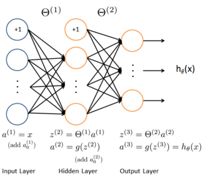

```{r opt, echo=FALSE}
knitr::opts_chunk$set(echo = TRUE, message = FALSE, warning = FALSE, cache=TRUE, fig.align="center")
sources <- c("displayData.r","../lib/sigmoid.r","lrCostFunction.r", "oneVsAll.r","predict.r", "predictOneVsAll.r")
sources <- c(sources[1:2], paste0(substr(sources[-c(1:2)],1,nchar(sources[-c(1:2)])-2), '-solution.r'))
invisible(lapply(sources, source))
```

This programming exercise instruction was originally developed and written by Prof. 
Andrew Ng as part of his machine learning [course](https://www.coursera.org/learn/machine-learning) on Coursera platform.
I have adapted the instruction for R language, so that its users, including myself, could also take and benefit from the course.

## Introduction

In this exercise, you will implement logistic regression and apply it to two
different datasets. Before starting on the programming exercise, we strongly
recommend watching the video lectures and completing the review questions
for the associated topics.
To get started with the exercise, you will need to download the starter
code and unzip its contents to the directory where you wish to complete the
exercise. If needed, use the `setwd()` function in R to change to this directory before starting this exercise.

Files included in this exercise:

- `ex3.r` - R script that steps you through part 1
- `ex3_nn.r` - R script that steps you through part 2
- `ex3data1.rda` - Training set of hand-written digits
- `ex3weights.rda` - Initial weights for the neural network exercise
- `submit.r` - Submission script that sends your solutions to our servers
- `displayData.r` - Function to help visualize the dataset
- `sigmoid.r` - Sigmoid function
- [⋆] `lrCostFunction.r` - Logistic regression cost function
- [⋆] `oneVsAll.r` - Train a one-vs-all multi-class classifier
- [⋆] `predictOneVsAll.r` - Predict using a one-vs-all multi-class classifier
- [⋆] `predict.r` - Neural network prediction function

⋆ indicates files you will need to complete

Throughout the exercise, you will be using the scripts `ex3.r` and `ex3_nn.r`.
These scripts set up the dataset for the problems and make calls to functions
that you will write. You do not need to modify these scripts. You are only
required to modify functions in other files, by following the instructions in
this assignment.

### Where to get help

The exercises in this course use R, a high-level programming language
well-suited for numerical computations. If you do not have R installed, please
download a Windows installer from
[R-project](https://cran.r-project.org/bin/windows/base/) website.
[R-Studio](https://rstudio.com/products/rstudio/download/) is a free and
open-source R integrated development environment (IDE) making R script
development a bit easier when compared to the R's own basic GUI. You may start
from the `.rproj` (a R-Studio project file) in each exercise directory. 
At the R command line, typing help followed by a
function name displays documentation for that function. For example,
`help('plot')` or simply `?plot` will bring up help information for plotting.
Further documentation for R functions can be found at the R documentation pages. 

## 1 Multi-class Classification

For this exercise, you will use logistic regression and neural networks to
recognize handwritten digits (from 0 to 9). Automated handwritten digit
recognition is widely used today - from recognizing zip codes (postal codes)
on mail envelopes to recognizing amounts written on bank checks.
This exercise will show you how the methods you've learned can be used for this
classification task.
In the first part of the exercise, you will extend your previous implemention
of logistic regression and apply it to one-vs-all classification.

### 1.1 Dataset

You are given a data set in `ex3data1.rda` that contains 5000 training examples
of handwritten digits.[^1] The `.rda` format means that that the data has
been saved in a native R matrix format, instead of a text
(ASCII) format like a csv-file. These matrices can be read directly into your
program by using the `load` function. After loading, matrices of the correct
dimensions and values will appear in your program's memory. The matrices
will already be named as elements of the `data` list. `list2env` function
defines them in R's global environment for convenience and is wrapped  in `invisible` function to prevent the
printing of the returned object. Finally, `rm` function removes the `data` object.

```{r}
# load X and y matrices into the global environment
load('ex3data1.rda')
```

There are 5000 training examples in `ex3data1.rda`, where each training
example is a 20 pixel by 20 pixel grayscale image of the digit. Each pixel is
represented by a floating point number indicating the grayscale intensity at
that location. The 20 by 20 grid of pixels is "unrolled" into a 400-dimensional
vector. Each of these training examples becomes a single row in our data
matrix X. This gives us a 5000 by 400 matrix X where every row is a training
example for a handwritten digit image.

$$
X=\begin{pmatrix} 
- & (x^{(1)})^T & - \\
- & (x^{(2)})^T & - \\
 & \vdots & \\
- & (x^{(m)})^T & -
\end{pmatrix}
$$

The second part of the training set is a 5000-dimensional vector y that
contains labels for the training set. To make things more compatible with
R indexing, where there is no zero index, we have mapped
the digit zero to the value ten. Therefore, a "0" digit is labeled as "10", while
the digits "1" to "9" are labeled as "1" to "9" in their natural order.

### 1.2 Visualizing the data

You will begin by visualizing a subset of the training set. In Part 1 of `ex3.r`,
the code randomly selects 100 rows from X and passes those rows
to the `displayData` function. This function maps each row to a 20 pixel by
20 pixel grayscale image and displays the images together. We have provided
the `displayData` function, and you are encouraged to examine the code to
see how it works. After you run this step, you should see an image like Figure 1.

[^1]: This is a subset of the MNIST handwritten digit dataset (http://yann.lecun.com/exdb/mnist/).

```{r, fig.cap="Figure 1: Examples from the dataset", echo=FALSE}
m <- dim(X)[1]
# Randomly select 100 data points to display
rand_indices <- sample(m)
sel <- X[rand_indices[1:100], ]
displayData(sel)
```

### 1.3 Vectorizing Logistic Regression

You will be using multiple one-vs-all logistic regression models to build a
multi-class classifier. Since there are 10 classes, you will need to train 10
separate logistic regression classifiers. To make this training efficient, it is
important to ensure that your code is well vectorized. In this section, you
will implement a vectorized version of logistic regression that does not employ
any for loops. You can use your code in the last exercise as a starting point
for this exercise.

#### 1.3.1 Vectorizing the cost function

We will begin by writing a vectorized version of the cost function. Recall
that in (unregularized) logistic regression, the cost function is

$$J(\theta)=\frac{1}{m}\sum_{i=1}^m [-y^{(i)}log(h_\theta(x^{(i)})) - (1-y^{(i)}) log(1-h_\theta(x^{(i)})) ],$$

To compute each element in the summation, we have to compute
$h_\theta(x^{(i)})$ for every example i, where
$h_\theta(x^{(i)})=g(\theta^Tx^{(i)})$ and $g(z)=\frac{1}{1+e^{-z}}$ is the
sigmoid function. It turns out that we can compute this quickly for all of our
examples by using matrix multiplication. Let us define X and $\theta$ as

$$ X=\begin{pmatrix} 
- & (x^{(1)})^T & - \\
- & (x^{(2)})^T & - \\
 & \vdots & \\
- & (x^{(m)})^T & -
\end{pmatrix}
\qquad
\vec{\theta}=\begin{pmatrix}
\theta^{(1)} \\
\theta^{(2)} \\
\vdots \\
\theta^{(m)}
\end{pmatrix}
$$

Then, by computing the matrix product $X\theta$, we have

$$
X\theta=\begin{pmatrix} 
- & (x^{(1)})^T\theta & - \\
- & (x^{(2)})^T\theta & - \\
 & \vdots & \\
- & (x^{(m)})^T\theta & -
\end{pmatrix}
=\begin{pmatrix} 
- & \theta^T(x^{(1)}) & - \\
- & \theta^T(x^{(2)}) & - \\
 & \vdots & \\
- & \theta^T(x^{(m)}) & -
\end{pmatrix}
$$

In the last equality, we used the fact that $a^Tb = b^Ta$ if $a$ and $b$ are vectors.
This allows us to compute the products $\theta^Tx^{(i)}$ for all our examples $i$ in one line of code.
Your job is to write the unregularized cost function in the file `lrCostFunction.r`.
Your implementation should use the strategy we presented above to calculate $\theta^Tx^{(i)}$. You should also use a vectorized approach for the rest of the cost function. A fully vectorized version of `lrCostFunction.r` should not contain any loops.
(Hint: You might want to use the element-wise multiplication operation (*) and the sum operation `sum` when writing this function)

#### 1.3.2 Vectorizing the gradient

Recall that the gradient of the (unregularized) logistic regression cost is a
vector where the $j^th$ element is defined as

$$\frac{\partial J(\theta)}{\partial \theta_j} = \frac{1}{m}\sum_{i=1}^m (h_\theta(x^{(i)}) - y^{(i)}) x_j^{(i)}$$

To vectorize this operation over the dataset, we start by writing out all the partial derivatives explicitly for all $\theta_j$,

\begin{align*}
\left[\begin{array}{c}
\frac{\partial J}{\partial \theta_0}\\ 
\frac{\partial J}{\partial \theta_1}\\ 
\frac{\partial J}{\partial \theta_2}\\
\vdots                              \\
\frac{\partial J}{\partial \theta_n} 
\end{array} \right] 
&= \frac{1}{m}\left[\begin{array}{c}
\sum_{i=1}^m\left((h_\theta(x^{(i)})-y^{(i)})x_0^{(i)}\right)\\
\sum_{i=1}^m\left((h_\theta(x^{(i)})-y^{(i)})x_1^{(i)}\right)\\
\sum_{i=1}^m\left((h_\theta(x^{(i)})-y^{(i)})x_2^{(i)}\right)\\
\vdots\\
\sum_{i=1}^m\left((h_\theta(x^{(i)})-y^{(i)})x_n^{(i)}\right)
\end{array} \right] \qquad(1) \\
&= \frac{1}{m}\sum_{i=1}^m\left((h_\theta(x^{(i)})-y^{(i)})x^{(i)}\right)\\
&= \frac{1}{m}X^T(h_\theta(x)-y).
\end{align*}

where

$$ h_\theta(x)-y=\left[\begin{array}{c}
h_\theta(x^{(1)})-y^{(1)}\\
h_\theta(x^{(2)})-y^{(2)}\\
\vdots\\
h_\theta(x^{(m)})-y^{(m)}\\
\end{array}
\right].
$$

Note that $x(i)$ is a vector, while $(h_\theta(x^{(i)})-y^{(i)})$ is a scalar (single number).
To understand the last step of the derivation, let $\beta_i = (h_\theta(x^{(i)}) - y^{(i)})$ and observe that:

$$\sum_i\beta_ix^{(i)}=\left[\begin{array}{cccc}
| & | & & | \\
x^{(1)} & x^{(2)} & \ldots & x^{(m)} \\
| & | & & | 
\end{array}
\right]
\left[
\begin{array}{c}
\beta_1\\
\beta_2\\
\vdots \\
\beta_m
\end{array}
\right]=X^T\beta,
$$

where the values $\beta_i = (h_\theta(x^{(i)}) - y^{(i)}).$

The expression above allows us to compute all the partial derivatives
without any loops. If you are comfortable with linear algebra, we encourage
you to work through the matrix multiplications above to convince yourself
that the vectorized version does the same computations. You should now
implement Equation 1 to compute the correct vectorized gradient. Once you
are done, complete the function `lrCostFunction.r` by implementing the gradient.

___
**Debugging Tip:** Vectorizing code can sometimes be tricky. 
One common strategy for debugging is to print out the sizes of the matrices you
are working with using the size function. For example, given a data 
matrix $X$ of size $100 \times 20$ (100 examples, 20 features) and $\theta$, a vector with
dimensions $20\times1$, you can observe that $X\theta$ is a valid multiplication operation, while $\theta X$ is not.
Furthermore, if you have a non-vectorized version
of your code, you can compare the output of your vectorized code and
non-vectorized code to make sure that they produce the same outputs.

___

#### 1.3.3 Vectorizing regularized logistic regression

After you have implemented vectorization for logistic regression, you will now
add regularization to the cost function. Recall that for regularized logistic
regression, the cost function is defined as

$$
J(\theta)=\frac{1}{m}\sum_{i=1}^m [-y^{(i)} log(h_\theta(x^{(i)})) - 
(1-y^{(i)}) log(1-h_\theta(x^{(i)})) ] +
\frac{\lambda}{2m} \sum_{j=1}^n \theta_j^2.
$$

Note that you should not be regularizing $\theta_0$ which is used for the bias
term. Correspondingly, the partial derivative of regularized logistic regression
cost for $\theta_j$ is defined as

$$
\begin{array}{ll}
\frac{\partial J(\theta)}{\partial \theta_0} = \frac{1}{m}\sum_{i=1}^m (h_\theta(x^{(i)}) - y^{(i)}) x_j^{(i)} & \text{for $j=0$}\\
\frac{\partial J(\theta)}{\partial \theta_j} = \left (\frac{1}{m}\sum_{i=1}^m (h_\theta(x^{(i)}) - y^{(i)}) x_j^{(i)} \right) + \frac{\lambda}{m}\theta_j & \text{for $j \geq 1$}
\end{array}
$$

Now modify your code in `lrCostFunction` to account for regularization.
Once again, you should not put any loops into your code.

___
**R Tip:** When implementing the vectorization for regularized logistic regression,
you might often want to only sum and update certain elements of $\theta$. In R, you
can index into the matrices to access and update only certain elements. For
example, `A[, 3:5] <- B[, 1:3]` will replace the columns 3 to 5 of A with the
columns 1 to 3 from B. Negative values could be used
in indexing. This allows us to exclude columns (or rows) from the
matrix. For example, `A[, -1]` will only return elements from the $2^{nd}$
to last column of A. Thus, you could use this together with the `sum` and `^`
operations to compute the sum of only the elements you are interested in 
(e.g., `sum(z[-1]^2)`). In the starter code, `lrCostFunction.r`, we
have also provided hints on yet another possible method for computing the regularized gradient.

___

*You should now submit your solutions.*

### 1.4 One-vs-all Classification

In this part of the exercise, you will implement one-vs-all classification by
training multiple regularized logistic regression classifiers, one for each of
the K classes in our dataset (Figure 1). In the handwritten digits dataset,
$K = 10$, but your code should work for any value of K.
You should now complete the code in `oneVsAll.r` to train one classifier for
each class. In particular, your code should return all the classifier parameters
in a matrix $\Theta \in \mathbb{R}^{K\times(N+1)}$, where each row of $\Theta$ corresponds to the learned
logistic regression parameters for one class. You can do this with a for loop
from 1 to K, training each classifier independently.
Note that the y argument to this function is a vector of labels from 1 to
10, where we have mapped the digit 0 to the label 10 (to avoid confusions with indexing).
When training the classifier for class $k \in {1, ..., K}$, you will want a
m-dimensional vector of labels y, where $y_j \in 0$, 1 indicates whether the
$j^{th}$ training instance belongs to class $k (y_j = 1)$, or if it belongs to
a different class $(y_j = 0)$. You may find logical arrays helpful for this task.

___
**R Tip:** Logical arrays in R are arrays
which contain binary (TRUE or FALSE) elements. In R, evaluating
the expression `a==b` for a vector `a` (of size $m\times1$) and scalar `b` will return
a vector of the same size as `a` with `TRUE` at positions where the elements
of `a` are equal to `b` and `FALSE` where they are different. To see how this
works for yourself, try the following code in R:

```{r}
a = 1:10
b = 3
# You should try different values of b here
a == b
```
___

After you have correctly completed the code for `oneVsAll.r`, the script
`ex3.r` will continue to use your `oneVsAll` function to train a multi-class classifier.

*You should now submit your solutions.*

#### 1.4.1 One-vs-all Prediction

After training your one-vs-all classifier, you can now use it to predict the
digit contained in a given image. For each input, you should compute the
probability that it belongs to each class using the trained logistic regression
classifiers. Your one-vs-all prediction function will pick the class for which the
corresponding logistic regression classifier outputs the highest probability and
return the class label $(1, 2, \ldots, or K)$ as the prediction for the input example.
You should now complete the code in `predictOneVsAll.r` to use the
one-vs-all classifier to make predictions.
Once you are done, `ex3.r` will call your `predictOneVsAll` function using
the learned value of $\Theta$. You should see that the training set accuracy is about
94.9% (i.e., it classifies 94.9% of the examples in the training set correctly).

*You should now submit your solutions.*

## 2 Neural Networks

In the previous part of this exercise, you implemented multi-class logistic 
regression to recognize handwritten digits. However, logistic regression cannot
form more complex hypotheses as it is only a linear classifier.[^3]

[^3]: You could add more features (such as polynomial features) to logistic regression, but that can be very expensive to train.

In this part of the exercise, you will implement a neural network to recognize
handwritten digits using the same training set as before. The neural
network will be able to represent complex models that form non-linear hypotheses.
For this week, you will be using parameters from a neural network
that we have already trained. Your goal is to implement the feedforward
propagation algorithm to use our weights for prediction.
In next week's exercise, you will write the backpropagation algorithm for learning the neural
network parameters.
The provided script, `ex3_nn.r`, will help you step through this exercise.

### 2.1 Model representation

Our neural network is shown in Figure 2. It has 3 layers – an input layer, a
hidden layer and an output layer. Recall that our inputs are pixel values of
digit images. Since the images are of size $20\times20$, this gives us 400 input layer
units (excluding the extra bias unit which always outputs +1). As before,
the training data will be loaded into the variables $X$ and $y$.
You have been provided with a set of network parameters $(\Theta(1), \Theta(2))$
already trained by us.
These are stored in `ex3weights.rda` and will be
loaded by `ex3_nn.r` into `Theta1` and `Theta2`. The parameters have dimensions
that are sized for a neural network with 25 units in the second layer and 10
output units (corresponding to the 10 digit classes).

```{r}
# Load the matrices Theta1 and Theta2 in your R global environment
# Theta1 has size 25 x 401
# Theta2 has size 10 x 26
load('ex3weights.rda')
```

<div align='center'>
<p>Figure 2: Neural network model.
</div>

### 2.2 Feedforward Propagation and Prediction

Now you will implement feedforward propagation for the neural network. You
will need to complete the code in `predict.r` to return the neural network's
prediction.
You should implement the feedforward computation that computes $h_\theta(x^{(i)})$
for every example $i$ and returns the associated predictions. Similar to the
one-vs-all classification strategy, the prediction from the neural network will
be the label that has the largest output $(h_\theta(x))_k$.

___
**Implementation Note:** The matrix `X` contains the examples in rows.
When you complete the code in `predict.r`, you will need to add the
column of 1's to the matrix. The matrices `Theta1` and `Theta2` contain
the parameters for each unit in rows. Specifically, the first row of `Theta1`
corresponds to the first hidden unit in the second layer. In R, when you compute 
$z^{(2)} = \Theta^{(1)}a^{(1)}$, be sure that you index (and if necessary,
transpose) $X$ correctly so that you get $a^{(l)}$ as a column vector.

___

Once you are done, `ex3_nn.r` will call your predict function using the
loaded set of parameters for `Theta1` and `Theta2`. You should see that the
accuracy is about 97.5%. After that, an interactive sequence will launch displaying
images from the training set one at a time, while the console prints
out the predicted label for the displayed image. To stop the image sequence,
press <kbd>Ctrl-C</kbd>.

*You should now submit your solutions.*

## Submission and Grading

After completing this assignment, be sure to use the submit function to sub-
mit your solutions to our servers. The following is a breakdown of how each
part of this exercise is scored.

| Part                               | Submitted File      | Points     |
| :-------------                              | :----                     | :--------: |
| Regularized Logisic Regression     | `lrCostFunction.r`  | 30 points  |
| One-vs-all classifier training     | `oneVsAll.r`        | 20 points  |
| One-vs-all classifier prediction   | `predictOneVsAll.r` | 20 points  |
| Neural Network Prediction Function | `predict.r`         | 30 points  |
| Total Points                       |                     | 100 points |

You are allowed to submit your solutions multiple times, and we will take
only the highest score into consideration.
