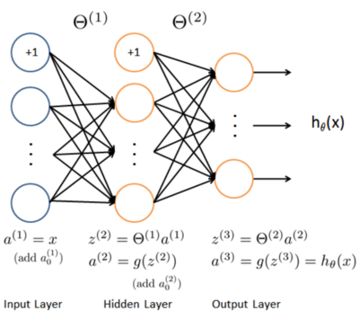
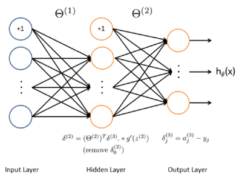

```{r opt, echo=FALSE}
knitr::opts_chunk$set(echo = TRUE, message = FALSE, warning = FALSE, cache=TRUE, fig.align="center")
sources <- c("../lib/sigmoid.r","checkNNGradients.r","computeNumericalGradient.r",
             "debugInitializeWeights.r","displayData.r", "predict.r",
             "nnCostFunction.r","randInitializeWeights.r", "sigmoidGradient.r")
sources <- c(sources[1:6], paste0(substr(sources[7:9], 1, nchar(sources[7:9])-2), '-solution.r'))
invisible(lapply(sources, source))
```

This programming exercise instruction was originally developed and written by Prof. 
Andrew Ng as part of his machine learning [course](https://www.coursera.org/learn/machine-learning) on Coursera platform.
I have adapted the instruction for R language, so that its users, including myself, could also take and benefit from the course.

## Introduction

In this exercise, you will implement the backpropagation algorithm for neural
networks and apply it to the task of hand-written digit recognition. 
Before starting on the programming exercise, we strongly
recommend watching the video lectures and completing the review questions
for the associated topics.
To get started with the exercise, you will need to download the starter
code and unzip its contents to the directory where you wish to complete the
exercise. If needed, use the `setwd()` function in R to change to this directory before starting this exercise.

Files included in this exercise
 
- `ex4.r` - R script that steps you through the exercise
- `ex4data1.rda` - Training set of hand-written digits
- `ex4weights.rda` - Neural network parameters for exercise 4
- `submit.r` - Submission script that sends your solutions to our servers
- `displayData.r` - Function to help visualize the dataset
- `sigmoid.r` - Sigmoid function
- `computeNumericalGradient.r` - Numerically compute gradients
- `checkNNGradients.r` - Function to help check your gradients
- `debugInitializeWeights.r` - Function for initializing weights
- `predict.r` - Neural network prediction function
- [⋆] `sigmoidGradient.r` - Compute the gradient of the sigmoid function
- [⋆] `randInitializeWeights.r` - Randomly initialize weights
- [⋆] `nnCostFunction.r` - Neural network cost function

⋆ indicates files you will need to complete

Throughout the exercise, you will be using the script `ex4.r`. These scripts
set up the dataset for the problems and make calls to functions that you will
write. You do not need to modify the script. You are only required to modify
functions in other files, by following the instructions in this assignment.

### Where to get help

The exercises in this course use R, a high-level programming language
well-suited for numerical computations. If you do not have R installed, please
download a Windows installer from
[R-project](https://cran.r-project.org/bin/windows/base/) website.
[R-Studio](https://rstudio.com/products/rstudio/download/) is a free and
open-source R integrated development environment (IDE) making R script
development a bit easier when compared to the R's own basic GUI. You may start
from the `.rproj` (a R-Studio project file) in each exercise directory. 
At the R command line, typing help followed by a
function name displays documentation for that function. For example,
`help('plot')` or simply `?plot` will bring up help information for plotting.
Further documentation for R functions can be found at the R documentation pages. 

## 1 Neural Networks

In the previous exercise, you implemented feedforward propagation for neural
networks and used it to predict handwritten digits with the weights we
provided. In this exercise, you will implement the backpropagation algorithm
to learn the parameters for the neural network.
The provided script, `ex4.r`, will help you step through this exercise.

### 1.1 Visualizing the data

In the first part of `ex4.r`, the code will load the data and display it on a
2-dimensional plot (Figure 1) by calling the function `displayData`.

```{r, fig.cap="Figure 1: Examples from the dataset",echo=F}
load('ex4data1.rda')
m <- dim(X)[1]
# Randomly select 100 data points to display
sel <- sample(m)
sel <- sel[1:100]
displayData(X[sel,])
```

This is the same dataset that you used in the previous exercise. There are
5000 training examples in `ex3data1.rda`, where each training example is a
20 pixel by 20 pixel grayscale image of the digit. Each pixel is represented by
a floating point number indicating the grayscale intensity at that location.
The 20 by 20 grid of pixels is "unrolled" into a 400-dimensional vector. Each
of these training examples becomes a single row in our data matrix $X$. This
gives us a 5000 by 400 matrix $X$ where every row is a training example for a
handwritten digit image.

$$
X=\begin{pmatrix} 
- & (x^{(1)})^T & - \\
- & (x^{(2)})^T & - \\
 & \vdots & \\
- & (x^{(m)})^T & -
\end{pmatrix}
$$

The second part of the training set is a 5000-dimensional vector y that
contains labels for the training set. To make things more compatible with
R indexing, where there is no zero index, we have mapped
the digit zero to the value ten. Therefore, a "0" digit is labeled as "10", while
the digits "1" to "9" are labeled as "1" to "9" in their natural order.

### 1.2 Model representation

Our neural network is shown in Figure 2. It has 3 layers – an input layer,
a hidden layer and an output layer. Recall that our inputs are pixel values
of digit images. Since the images are of size $20\times20$, this gives us 400 input
layer units (not counting the extra bias unit which always outputs +1). The
training data will be loaded into the variables $X$ and $y$ by the `ex4.r` script.
You have been provided with a set of network parameters $(\Theta^{(1)}, \Theta^{(2)})$
already trained by us.
These are stored in `ex4weights.rda` and will be
loaded by `ex4.r` into `Theta1` and `Theta2`. The parameters have dimensions
that are sized for a neural network with 25 units in the second layer and $10$
output units (corresponding to the 10 digit classes).

```{r}
# Load saved matrices from file
# The matrices Theta1 and Theta2 will now be in your workspace
load('ex4weights.rda')
# Theta1 has size 25 x 401
# Theta2 has size 10 x 26
``` 

<div align='center'>
<p>Figure 2: Neural network model.
</div>

### 1.3 Feedforward and cost function

Now you will implement the cost function and gradient for the neural network. First, complete the code in `nnCostFunction.r` to return the cost. Recall that the cost function for the neural network (without regularization) is

$$J(\theta)=\frac{1}{m}\sum_{i=1}^m\sum_{k=1}^{K} [-y_k^{(i)}log(h_\theta(x^{(i)}))_k - (1-y_k^{(i)}) log(1-(h_\theta(x^{(i)}))_k)],$$

where $h_\theta(x^{(i)})$ is computed as shown in the Figure 2 and $K = 10$ is
the total number of possible labels. Note that $h_\theta(x^{(i)})_k = a_k^{(3)}$
is the activation (output value) of the $k$-th output unit. Also, recall that whereas the original labels
(in the variable y) were $1,2,\ldots,10$ for the purpose of training a neural network, 
we need to recode the labels as vectors containing only values $0$ or $1$, so that

$$
y=\left[\begin{array}{c}
          1\\0\\0\\\vdots\\0
          \end{array}\right], \qquad 
\left[\begin{array}{c}0\\1\\0\\\vdots\\0\end{array}\right], \qquad \ldots \qquad or \qquad 
\left[\begin{array}{c}0\\0\\0\\\vdots\\1\end{array}\right].
$$

For example, if $x^{(i)}$ is an image of the digit 5, then the corresponding
$y^{(i)}$ (that you should use with the cost function) should be a 10-dimensional
vector with $y_5=1$, and the other elements equal to 0.
You should implement the feedforward computation that computes $h_\theta(x^{(i)})$
for every example $i$ and sum the cost over all examples. Your code should
also work for a dataset of any size, with any number of labels (you can assume that there are always at least $K \geq 3$ labels).

___
**Implementation Note:** The matrix $X$ contains the examples in rows
(i.e., `X[i,]` is the i-th training example $x^{(i)}$, expressed as a $n \times 1$ vector.)
When you complete the code in `nnCostFunction.r`, you will
need to add the column of $1$'s to the $X$ matrix. The parameters for each
unit in the neural network is represented in `Theta1` and `Theta2` as one
row. Specifically, the first row of `Theta1` corresponds to the first hidden
unit in the second layer. You can use a for-loop over the examples to
compute the cost.

___

Once you are done, `ex4.r` will call your `nnCostFunction` using the loaded
set of parameters for `Theta1` and `Theta2`. You should see that the cost is
about $0.287629$.

*You should now submit your solutions.*

### 1.4 Regularized cost function

The cost function for neural networks with regularization is given by

$$J(\theta)=\frac{1}{m}\sum_{i=1}^m\sum_{k=1}^{K} [-y_k^{(i)}log(h_\theta(x^{(i)}))_k - (1-y_k^{(i)}) log(1-(h_\theta(x^{(i)}))_k)]+
\frac{\lambda}{2m}\left[ \sum_{j=1}^{25}\sum_{k=1}^{400}(\Theta_{j,k}^{(1)})^2+\sum_{j=1}^{10}\sum_{k=1}^{25}(\Theta_{j,k}^{(2)})^2\right].
$$

You can assume that the neural network will only have 3 layers – an input
layer, a hidden layer and an output layer. However, your code should work
for any number of input units, hidden units and outputs units. While we
have explicitly listed the indices above for $\Theta^{(1)}$ and $\Theta^{(2)}$ for clarity, do note
that **your code should in general work with $\Theta^{(1)}$ and $\Theta^{(2)}$ of any size.**
Note that you should not be regularizing the terms that correspond to
the bias. For the matrices `Theta1` and `Theta2`, this corresponds to the first
column of each matrix. You should now add regularization to your cost
function. Notice that you can first compute the unregularized cost function
$J$ using your existing `nnCostFunction.r` and then later add the cost for the
regularization terms.
Once you are done, `ex4.r` will call your `nnCostFunction` using the loaded
set of parameters for `Theta1` and `Theta2`, and $\lambda = 1$. You should see that
the cost is about $0.383770$.

*You should now submit your solutions.*

## 2 Backpropagation

In this part of the exercise, you will implement the backpropagation 
algorithm to compute the gradient for the neural network cost function. You
will need to complete the `nnCostFunction.r` so that it returns an appropriate
value for grad. Once you have computed the gradient, you will be able
to train the neural network by minimizing the cost function $J(\Theta)$ using an
advanced optimizer such as `optim`.
You will first implement the backpropagation algorithm to compute the
gradients for the parameters for the (unregularized) neural network. After
you have verified that your gradient computation for the unregularized case
is correct, you will implement the gradient for the regularized neural network.

### 2.1 Sigmoid gradient

To help you get started with this part of the exercise, you will first implement
the sigmoid gradient function. The gradient for the sigmoid function can be computed as

$$g'(z)=\frac{d}{dz}g(z)=g(z)(1-g(z))$$

where

$$sigmoid(z) = g(z) =\frac{1}{1+e^{-z}}$$

When you are done, try testing a few values by calling `sigmoidGradient(z)`
at the R command line. For large values (both positive and negative) of $z$, 
the gradient should be close to $0$. When `z = 0`, the gradient should be exactly $0.25$.
Your code should also work with vectors and
matrices. For a matrix, your function should perform the sigmoid gradient
function on every element.

*You should now submit your solutions.*

### 2.2 Random initialization

When training neural networks, it is important to randomly initialize the
parameters for symmetry breaking. One effective strategy for random
initialization is to randomly select values for $\Theta^{(l)}$ uniformly in the
range $[-\epsilon_{init}, \epsilon_{init}]$.
You should use $\epsilon_{init} = 0.12.$[^1] This range of values ensures that the parameters
are kept small and makes the learning more efficient.
Your job is to complete `randInitializeWeights.r` to initialize the weights
for $\Theta$; modify the file and fill in the following code:

```{r, eval=F}
epsilon_init <- 0.12
rnd <- runif(L_out * (1 + L_in))
rnd <- matrix(rnd,L_out,1 + L_in)
W <- rnd * 2 * epsilon_init - epsilon_init
```

You do not need to submit any code for this part of the exercise.

[^1]: One effective strategy for choosing $\epsilon_{init}$ is to base it on the number of units in the
network. A good choice of $\epsilon_{init}$ is $\epsilon_{init}=\frac{\sqrt{6}}{\sqrt{L_{in}+L_{out}}}$, where $L_{in} = s_l$ and $L_{out} = s_{l+1}$ are the number of units in the layers adjacent to $\Theta^{(l)}$.

### 2.3 Backpropagation

<div align='center'>
<p>Figure 3: Backpropagation Updates.
</div>

Now, you will implement the backpropagation algorithm.
Recall that the intuition behind the backpropagation algorithm is as follows. Given a
training example $(x(t), y(t))$, we will first run a "forward pass" to compute
all the activations throughout the network, including the output value of the
hypothesis $h_\Theta(x)$. Then, for each node $j$ in layer l, we would like to compute
an "error term" $\delta_j^{(l)}$ that measures how much that node was "responsible"
for any errors in our output.
For an output node, we can directly measure the difference between the
network's activation and the true target value, and use that to define $\delta_j^{(3)}$
(since layer 3 is the output layer). For the hidden units, you will compute $\delta_j^{(l)}$
based on a weighted average of the error terms of the nodes in layer $(l + 1)$.
In detail, here is the backpropagation algorithm (also depicted in Figure 3). 
You should implement steps 1 to 4 in a loop that processes one example
at a time. Concretely, you should implement a for-loop for $t = 1:m$ and
place steps 1-4 below inside the for-loop, with the $t^{th}$ iteration performing
the calculation on the tth training example $(x^{(t)}, y^{(t)})$. Step 5 will divide the
accumulated gradients by m to obtain the gradients for the neural network cost function.

1. Set the input layer's values $(a^{(1)})$ to the $t$-th training example $x^{(t)}$.
Perform a feedforward pass (Figure 2), computing the activations $(z^{(2)}, a^{(2)}, z^{(3)}, a^{(3)})$
for layers 2 and 3. Note that you need to add a $+1$ term to ensure that
the vectors of activations for layers $a^{(1)}$ and $a^{(2)}$ also include the bias
unit. In R, if `a_1` is a column vector, adding one corresponds to `a_1 = [1 ; a_1]`.

2. For each output unit k in layer 3 (the output layer), set 
   $\delta_k^{(3)}=(a_k^{(3)}-y_k),$
   where $y_k \in {0, 1}$ indicates whether the current training example belongs
   to class $k (y_k = 1)$, or if it belongs to a different class $(y_k = 0)$.
   You may find logical arrays helpful for this task (explained in the previous programming exercise).

3. For the hidden layer $l = 2$, set
   $\delta^{(2)}=(\Theta^{(2)})^T\delta^{(3)}.*g'(z^{(2)})$

4. Accumulate the gradient from this example using the following formula. Note that you should skip or remove $\delta_0^{(2)}$. 
In R, removing $\delta_0^{(2)}$ corresponds to `delta_2 = delta_2[-1]`.

$$\Delta(l) = \Delta^{(l)} + \delta^{(l+1)}(a^{(l)})^T$$

5. Obtain the (unregularized) gradient for the neural network cost function by dividing the accumulated gradients by $\frac{1}{m}$:

$$\frac{\partial}{\partial\Theta_{ij}^{(l)}}J(\Theta)=D_{ij}^{(l)}=\frac{1}{m}\Delta_{ij}^{(l)}$$

___
**R Tip**: You should implement the backpropagation
algorithm only after you have successfully completed the feedforward and
cost functions. While implementing the backpropagation algorithm, it is
often useful to use the `dim` function to print out the sizes of the variables
you are working with if you run into dimension mismatch errors ("non-conformable arguments" errors in R).

___

After you have implemented the backpropagation algorithm, the script
`ex4.r` will proceed to run gradient checking on your implementation. The
gradient check will allow you to increase your confidence that your code is
computing the gradients correctly.

### 2.4 Gradient checking

In your neural network, you are minimizing the cost function $J(\Theta)$.
To perform gradient checking on your parameters, you can imagine "unrolling"
the parameters $\Theta^{(1)}$, $\Theta^{(2)}$ into a long vector $\theta$. By doing so, you can think of
the cost function being $J(\theta)$ instead and use the following gradient checking procedure.
Suppose you have a function $f_i^{(\theta)}$ that purportedly computes $\frac{\partial}{\partial\theta_i}J(\theta)$;
you'd like to check if $f_i$ is outputting correct derivative values.

Let $\theta^{(i+)}=\theta + \left[\begin{array}{c} 0\\0\\\vdots\\\epsilon\\\vdots\\0\end{array}\right]$ and 
$\theta^{(i-)}=\theta-\left[\begin{array}{c}0\\0\\\vdots\\\epsilon\\\vdots\\0\end{array}\right]$,

So, $\theta^{(i+)}$ is the same as $\theta$, except its $i$-th element has been incremented by
$\epsilon$. Similarly, $\theta^{(i-)}$ is the corresponding vector with the $i$-th element decreased
by $\epsilon$. You can now numerically verify $f_i(\theta)$'s correctness by checking, for each $i$, that:

$$f_i(\theta)\approx \frac{J(\theta^{(i+)})-J(\theta^{(i-)})}{2\epsilon}.$$

The degree to which these two values should approximate each other will
depend on the details of $J$. But assuming $\epsilon = 10^{-4}$, you'll usually find that
the left- and right-hand sides of the above will agree to at least 4 significant
digits (and often many more).
We have implemented the function to compute the numerical gradient for
you in `computeNumericalGradient.r`. While you are not required to modify
the file, we highly encourage you to take a look at the code to understand
how it works.
In the next step of `ex4.r`, it will run the provided function `checkNNGradients.r`
which will create a small neural network and dataset that will be used for
checking your gradients. If your backpropagation implementation is correct,

you should see a relative difference that is less than 1e-9.

___
**Practical Tip**: When performing gradient checking, it is much more
efficient to use a small neural network with a relatively small number
of input units and hidden units, thus having a relatively small number
of parameters. Each dimension of $\theta$ requires two evaluations of the cost
function and this can be expensive. In the function `checkNNGradients`,
our code creates a small random model and dataset which is used with
`computeNumericalGradient` for gradient checking.
Furthermore, after you are confident that your gradient computations are correct, you should
turn off gradient checking before running your learning algorithm.

**Practical Tip**: Gradient checking works for any function where you are
computing the cost and the gradient. Concretely, you can use the same
`computeNumericalGradient.r` function to check if your gradient 
implementations for the other exercises are correct too (e.g., logistic regression's
cost function).

___

*Once your cost function passes the gradient check for the (unregularized)
neural network cost function, you should submit the neural network gradient
function (backpropagation).*

### 2.5 Regularized Neural Networks

After you have successfully implemeted the backpropagation algorithm, you will
add regularization to the gradient. To account for regularization, it turns out
that you can add this as an additional term after computing the gradients using
backpropagation. Specifically, after you have computed $\Delta_{ij}^{(l)}$ using
backpropagation, you should add regularization using

$$\begin{array}{ll}
\frac{\partial}{\partial\Theta_{ij}^{(l)}}J(\Theta)=D_{ij}^{(l)}=\frac{1}{m}\Delta_{ij}^{(l)} & \text{for $j=0$}\\
\frac{\partial}{\partial\Theta_{ij}^{(l)}}J(\Theta)=D_{ij}^{(l)}=\frac{1}{m}\Delta_{ij}^{(l)}+\frac{\lambda}{m}\Theta_{ij}^{(l)} & \text{for $j\geq1$}
\end{array}$$

Note that you should not be regularizing the first column of $\Theta^{(l)}$ which
is used for the bias term. Furthermore, in the parameters $\Theta_{ij}^{(l)}$, $i$ is indexed

starting from 1, and $j$ is indexed starting from 0. Thus,

$$
\Theta^{(l)}=\left[
\begin{array}{ccc}
\Theta_{1,0}^{(i)} & \Theta_{1,1}^{(l)} & \ldots\\
\Theta_{2,0}^{(i)} & \Theta_{2,1}^{(l)} & \\
\vdots & & \ddots
\end{array}
\right]
$$

Somewhat confusingly, indexing in R starts from 1 (for both $i$ and $j$), thus
`Theta1[2, 1]` actually corresponds to $\Theta_{2,0}^{(l)}$ 
(i.e., the entry in the second row, first column of the matrix $\Theta^{(1)}$ shown above)
Now modify your code that computes grad in `nnCostFunction` to account
for regularization. After you are done, the `ex4.r` script will proceed to run
gradient checking on your implementation. If your code is correct, you should
expect to see a relative difference that is less than $1e-9$.

*You should now submit your solutions.*

### 2.6 Learning parameters using lbfgsb3

After you have successfully implemented the neural network cost function
and gradient computation, the next step of the `ex4.r` script will use `lbfgsb3` function
in `lbfgsb3c` package to learn a good set of parameters. It has a similiar
interface to `optim` but works faster and even with a limited memory
constraint.
After the training completes, the `ex4.r` script will proceed to report the
training accuracy of your classifier by computing the percentage of examples
it got correct. If your implementation is correct, you should see a reported
training accuracy of about 95.3% (this may vary by about 1% due to the random initialization).
It is possible to get higher training accuracies by
training the neural network for more iterations. We encourage you to try
training the neural network for more iterations (e.g., set `MaxIter` to 400) and
also vary the regularization parameter $\lambda$. With the right learning settings, it
is possible to get the neural network to perfectly fit the training set.

## 3 Visualizing the hidden layer

One way to understand what your neural network is learning is to visualize
what the representations captured by the hidden units. Informally, given a
particular hidden unit, one way to visualize what it computes is to find an
input $x$ that will cause it to activate (that is, to have an activation value $(a_i^{(l)})$ close to $1$). For the neural network you trained, notice that the $i^{th}$ row of $\Theta^{(1)}$ is a 401-dimensional vector that represents the parameter for the $i^th$
hidden unit. If we discard the bias term, we get a 400 dimensional vector
that represents the weights from each input pixel to the hidden unit.
Thus, one way to visualize the "representation" captured by the hidden
unit is to reshape this 400 dimensional vector into a $20 \times 20$ image and
display it.[^2] The next step of `ex4.r` does this by using the `displayData`
function and it will show you an image (similar to Figure 4) with 25 units,
each corresponding to one hidden unit in the network.
In your trained network, you should find that the hidden units 
corresponds roughly to detectors that look for strokes and other patterns in the input.

[^2]: It turns out that this is equivalent to finding the input that gives the highest activation
for the hidden unit, given a "norm" constraint on the input (i.e., $\|x\|_2 \leq 1$).

```{r, fig.cap="Figure 4: Visualization of Hidden Units.", echo=F, results='hide'}
input_layer_size  <- 400  # 20x20 Input Images of Digits
hidden_layer_size <- 25   # 25 hidden units
num_labels <- 10          # 10 labels, from 1 to 10
lambda <- 1

costFunction <- nnCostFunction(input_layer_size, hidden_layer_size, 
                                   num_labels, X, y, lambda) #over nn_params
gradFunction <- nnGradFunction(input_layer_size, hidden_layer_size, 
                               num_labels, X, y, lambda) #over nn_params

initial_Theta1 <- randInitializeWeights(input_layer_size, hidden_layer_size)
initial_Theta2 <- randInitializeWeights(hidden_layer_size, num_labels)

# Unroll parameters
initial_nn_params <- c(initial_Theta1,initial_Theta2)

library(lbfgsb3c)
opt <- lbfgsb3(initial_nn_params, fn=costFunction, gr=gradFunction,
                  control = list(trace=1,maxit=50))

nn_params <- opt$par
cost <- opt$value

# Obtain Theta1 and Theta2 back from nn_params
Theta1 <- matrix(nn_params[1:(hidden_layer_size * (input_layer_size + 1))],
                 hidden_layer_size, (input_layer_size + 1))

displayData(Theta1[, -1])
```

### 3.1 Optional (ungraded) exercise

In this part of the exercise, you will get to try out different learning settings
for the neural network to see how the performance of the neural network
varies with the regularization parameter $\lambda$ and number of training steps (the `MaxIter` option when using `optim`).
Neural networks are very powerful models that can form highly complex
decision boundaries. Without regularization, it is possible for a neural
network to "overfit" a training set so that it obtains close to 100% accuracy
on the training set but does not as well on new examples that it has not seen
before. You can set the regularization $\lambda$ to a smaller value and the `MaxIter`
parameter to a higher number of iterations to see this for youself.

You will also be able to see for yourself the changes in the visualizations
of the hidden units when you change the learning parameters $\lambda$ and `MaxIter.`

*You do not need to submit any solutions for this optional (ungraded) exercise.*

## Submission and Grading

After completing various parts of the assignment, be sure to use the submit
function system to submit your solutions to our servers. The following is a
breakdown of how each part of this exercise is scored.

| Part                                           | Submitted File      | Points     |
| :-------------                              | :----                     | :--------: |
| Feedforward and Cost Function                  | `nnCostFunction.r`  | 30 points  |
| Regularized Cost Function                      | `nnCostFunction.r`  | 15 points  |
| Sigmoid Gradient                               | `sigmoidGradient.r` | 5 points   |
| Neural Net Gradient Function (Backpropagation) | `nnCostFunction.r`  | 40 points  |
| Regularized Gradient                           | `nnCostFunction.r`  | 10 points  |
| Total Points                                   |                     | 100 points |

You are allowed to submit your solutions multiple times, and we will take
only the highest score into consideration.
